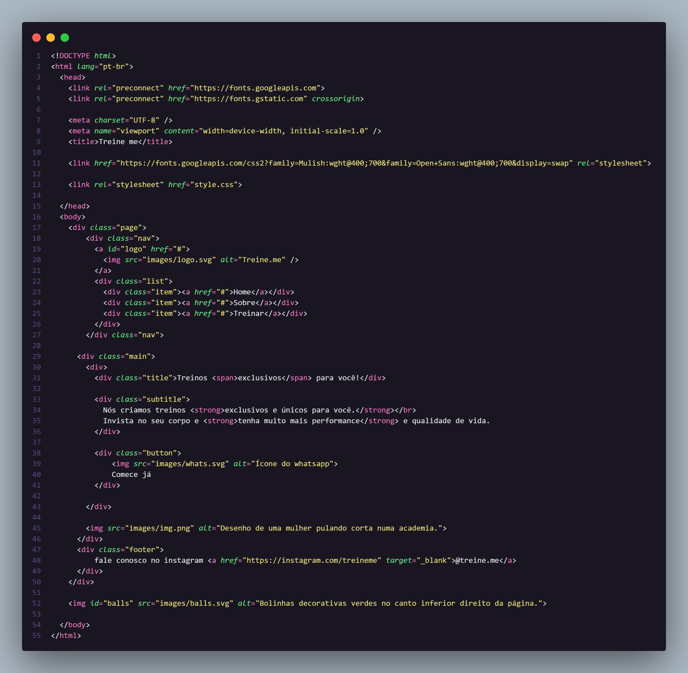

# 🧩 Projeto de acessibilidade com HTML semântico
Este projeto tem como objetivo melhorar a acessibilidade de um código HTML fornecido em uma aula, através da utilização de elementos HTML semânticos.

## 🧩 Desafio
O desafio proposto foi corrigir a semântica do código para torná-lo mais acessível. A página fornecida apresentava os elementos do HTML desorganizados e cheios de tags ``<div>``, o que dificultava a compreensão da estrutura da página e a navegação para usuários com deficiências visuais ou cognitivas.





## 🧩 Aprendizados

A prática que veio com o desafio foi muito importante para consolidar o conteúdo aprendido e reafirmar a importancia da acessibilidade em todos os nossos projetos. 


## 🧩 Stack utilizada

**Front-end:** HTML, CSS


## 🧩 Solução
Para resolver o problema, foram utilizadas as seguintes tags semânticas do HTML:

``<nav>``: define uma seção de navegação da página;

``<main>``: define o conteúdo principal da página;

``<section>``: define uma seção genérica da página;

``<h1>``: define um cabeçalho de nível 1;

``<p>``: define um parágrafo;

``<strong>``: define um texto em negrito;

``<button>``: define um botão;

````: define uma imagem;

``<footer>``: define o rodapé da página.

Ao utilizar essas tags semânticas, foi possível estruturar o código de forma mais organizada e significativa, tornando a página mais acessível para todos os usuários.

## 🧩 Layout do projeto
O layout do projeto pode ser visualizado através deste link do [Figma](https://www.figma.com/file/rkDOHGPwwFtBNqEdHSuQPd/Projeto-02---Explorer?node-id=0%3A1).


